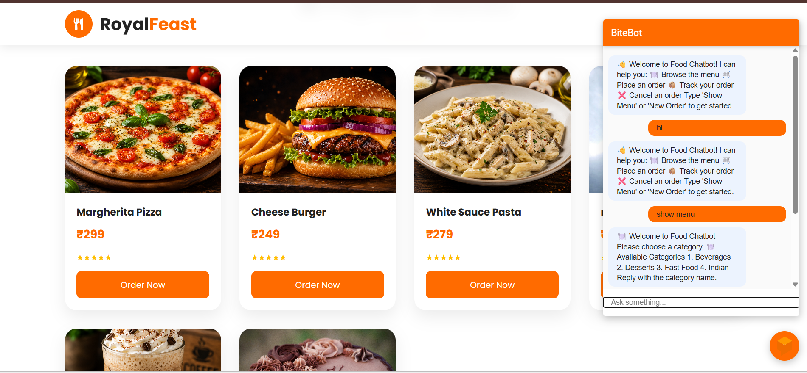
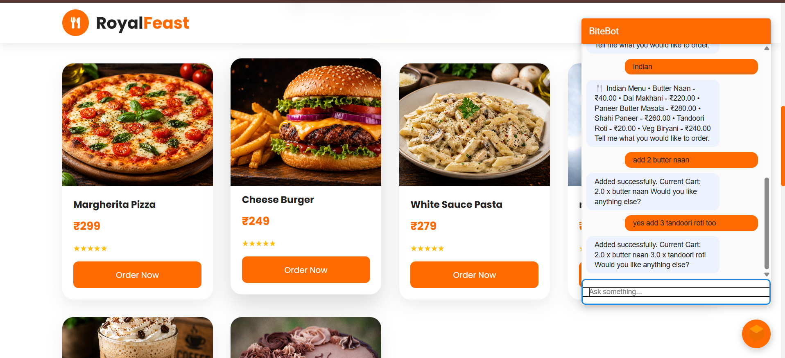
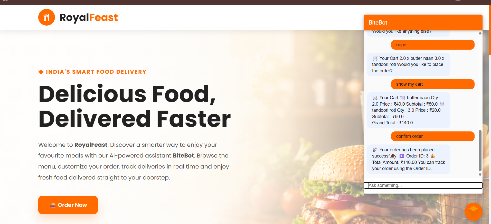
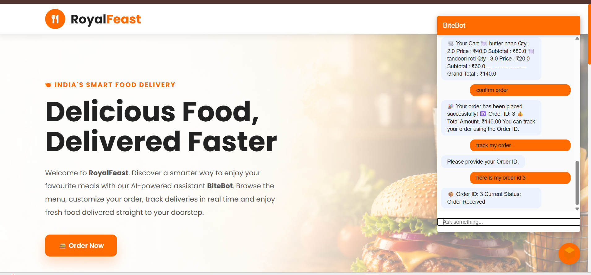

# 🍽️ BiteBot - AI Food Ordering Chatbot

BiteBot is an AI-powered food ordering chatbot that enables users to browse the menu, place orders, modify their cart, and track deliveries through natural language conversations. The application combines **Dialogflow ES** for intent recognition, a **FastAPI** backend for webhook fulfillment, a **React** frontend for an interactive user interface, and **MySQL** for persistent order and menu management.

---

# ✨ Features

* 🤖 AI-powered chatbot built with Dialogflow ES
* 🍕 Browse menu by food category
* 🛒 Add multiple food items to the cart
* ❌ Remove items from the cart
* 📋 View current cart contents
* ✅ Confirm and place food orders
* 🚚 Track orders using Order ID
* 💻 Responsive React frontend
* ⚡ FastAPI backend with webhook fulfillment
* 🗄️ MySQL database integration

---

# 🛠️ Tech Stack

### Frontend

* React.js
* Vite
* CSS3

### Backend

* FastAPI
* Python

### Database

* MySQL

### NLP

* Google Dialogflow ES

### Deployment

* Railway

---

# 📂 Project Structure

```text
FOOD_CHATBOT/
│
├── backend/                  # FastAPI backend
├── db/                       # MySQL database scripts
├── food-chatbot-frontend/    # React + Vite frontend
├── screenshots/              # Project screenshots
├── venv/
├── .env
├── .gitignore
└── README.md
```

---

# ⚙️ Installation

## 1. Clone the Repository

```bash
git clone https://github.com/sanket-codes23/BiteBot-A-AI-Food-ChatBot.git
cd BiteBot-A-AI-Food-ChatBot
```

## 2. Backend Setup

```bash
cd backend
pip install -r requirements.txt
uvicorn main:app --reload
```

## 3. Frontend Setup

```bash
cd food-chatbot-frontend
npm install
npm run dev
```

---

# 📸 Screenshots

## 1️⃣ Home Page

The React frontend provides a clean interface where users can start conversations with the AI chatbot.

<p align="center">
  
</p>

---

## 2️⃣ Food Ordering Conversation

Users can browse the menu, add or remove food items, and manage their cart using natural language.

<p align="center">
  
</p>

---

## 3️⃣ Order Confirmation

After reviewing the cart, the chatbot confirms the order and generates a unique Order ID.

<p align="center">
  
</p>

---

## 4️⃣ Order Tracking

Customers can check the real-time status of their orders by providing the generated Order ID.

<p align="center">
  
</p>


# 👨‍💻 Author

**Sanket Singhal**
B.Tech, Mathematics & Computing
**IIT (ISM) Dhanbad**

If you found this project useful, consider giving it a ⭐ on GitHub!
